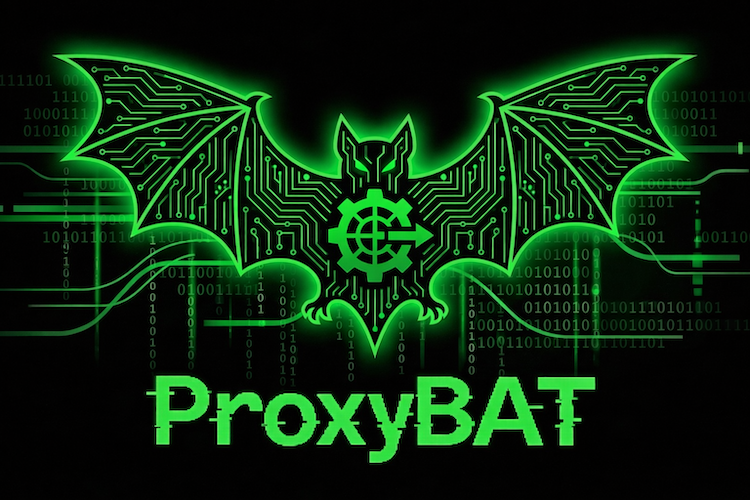

#  ProxyBat

<p align="center">
  
</p>

<p align="center">
  <strong>MITM Proxy with AI Agent Integration</strong>
</p>

<p align="center">
  <a href="#features">Features</a> •
  <a href="#installation">Installation</a> •
  <a href="#usage">Usage</a> •
  <a href="#ai-agents">AI Agents</a> •
  <a href="#contributing">Contributing</a> •
  <a href="#license">License</a>
</p>

<p align="center">
  
  
  
  
  
</p>

---

## Overview

**ProxyBat** is a powerful Man-in-the-Middle (MITM) proxy application built with Electron and React, featuring integrated AI agents for intelligent traffic analysis, security testing, and automated scripting. Designed for security researchers, developers, and QA engineers who need deep insights into HTTP/HTTPS traffic with the power of AI-assisted analysis.

## Features

### Core Proxy Functionality

- **HTTP/HTTPS Interception** - Capture and analyze all web traffic with automatic SSL/TLS certificate management
- **Real-time Traffic Monitoring** - View requests and responses in real-time with powerful filtering capabilities
- **Session Management** - Organize traffic into sessions for better workflow management
- **Request Replay** - Modify and resend requests with a built-in editor
- **Script Injection** - Create and manage Python scripts to modify requests/responses on-the-fly

### AI-Powered Agents

ProxyBat comes with specialized AI agents that can:

- **Security Researcher Agent** - Analyze traffic for security vulnerabilities, identify potential attack vectors, and provide detailed security assessments
- **Script Developer Agent** - Generate Python scripts for automated request/response modification based on your requirements
- **PoC Creator Agent** - Create proof-of-concept exploits and test cases from captured traffic
- **PoC Tester Agent** - Validate and test security proof-of-concepts automatically
- **General Agent** - Multi-purpose AI assistant for general proxy tasks and analysis

### Advanced Features

- **Built-in Terminal** - Integrated terminal for running commands and scripts
- **File System Tools** - AI agents can read, write, and analyze files in your workspace
- **LLM API Server** - Built-in OpenAI-compatible API server for integrating with other tools
- **Multiple AI Providers** - Support for OpenAI, Anthropic, GitHub Copilot, and more
- **Smart Filtering** - Filter traffic by domain, method, status code, and custom patterns
- **SSL/TLS Management** - Automatic certificate generation and management

## Installation

### Prerequisites

- **Node.js** 18+
- **Python** 3.11+ (for proxy functionality)
- **npm** or **yarn**

### From Source

```bash
# Clone the repository
git clone https://github.com/batuhank/proxybat.git
cd proxybat

# Install dependencies
npm install

# Run in development mode
npm run dev

# Build for production
npm run package
```

### From Homebrew (macOS)

```bash
# Install via Homebrew
brew tap batuhank/proxybat https://github.com/batuhank/proxybat
brew install --cask proxybat
```


### Pre-built Binary

Download the latest DMG from [GitHub Releases](https://github.com/batuhank/proxybat/releases).

## Usage

### Getting Started

1. **Launch ProxyBat** - Start the application and complete the initial setup
2. **Configure System Proxy** - Enable the system proxy to start capturing traffic
3. **Install Certificate** - Install the generated SSL certificate to intercept HTTPS traffic
4. **Start a Session** - Create a new session to organize your traffic capture

### Basic Workflow

1. **Start Proxy** - Click the "Start Proxy" button to begin traffic interception
2. **Browse** - Use your browser or applications normally
3. **Analyze Traffic** - View captured requests in the Traffic tab
4. **Use AI Agents** - Open the Chat tab to interact with specialized AI agents
5. **Modify & Replay** - Edit and resend requests using the Resend feature

### Using AI Agents

1. Navigate to the **Chat** tab
2. Select an agent type (Security Researcher, Script Developer, etc.)
3. Start a conversation with the AI about your traffic
4. The AI can:
   - Analyze specific requests for vulnerabilities
   - Generate Python scripts for traffic modification
   - Create and run security tests
   - Provide detailed reports

### Script Development

Create custom scripts to modify traffic:

```python
# Example: Add custom header to all requests
def request(flow):
    flow.request.headers["X-Custom-Header"] = "ProxyBat"

def response(flow):
    # Log response details
    print(f"Response: {flow.response.status_code}")
```

## Architecture

ProxyBat is built with a modern tech stack:

- **Frontend**: React 19 + TypeScript + Tailwind CSS
- **Desktop**: Electron 34
- **Proxy Engine**: Python mitmproxy integration
- **Database**: Better SQLite3 for local storage
- **State Management**: Zustand
- **UI Components**: Radix UI primitives
- **AI Integration**: Vercel AI SDK with multiple provider support

## Configuration

### AI Provider Setup

Configure your AI providers in the Settings tab:

- **OpenAI** - Add your API key
- **Anthropic** - Configure Claude API access
- **GitHub Copilot** - Use Copilot's AI capabilities
- **Custom Providers** - Add any OpenAI-compatible API

### Proxy Settings

- **Port Configuration** - Change the proxy port (default: 8080)
- **SSL Rules** - Configure which domains to intercept
- **Ignore Rules** - Exclude specific patterns from capture

## Security Considerations

⚠️ **Important Security Notes**:

- Only use ProxyBat on systems you own or have explicit permission to test
- The SSL certificate is generated locally - keep it secure
- Be cautious when running AI-generated scripts
- Review all AI suggestions before applying them to production systems
- Always follow responsible disclosure practices for vulnerabilities found

## Contributing

We welcome contributions! Please see our [Contributing Guide](CONTRIBUTING.md) for details.

### Development Setup

```bash
# Fork and clone
git clone https://github.com/YOUR_USERNAME/proxybat.git
cd proxybat

# Install dependencies
npm install

# Run development server
npm run dev
```

### Code Style

- We use TypeScript for type safety
- Follow the existing code patterns
- Run `npm run typecheck` before submitting PRs

## Roadmap

- [ ] Chrome extension for browser integration
- [ ] Team collaboration features
- [ ] Advanced reporting and export options
- [ ] Plugin system for custom extensions
- [ ] Mobile app companion
- [ ] Cloud synchronization

## Support

- 📖 [Documentation](https://github.com/batuhank/proxybat/wiki)
- 🐛 [Issue Tracker](https://github.com/batuhank/proxybat/issues)
- 💬 [Discussions](https://github.com/batuhank/proxybat/discussions)

## Acknowledgments

- Built with [Electron](https://www.electronjs.org/)
- Proxy functionality powered by [mitmproxy](https://mitmproxy.org/)
- UI components from [Radix UI](https://www.radix-ui.com/)
- AI integration via [Vercel AI SDK](https://sdk.vercel.ai/)

## License

This project is licensed under the MIT License - see the [LICENSE](LICENSE) file for details.

## Disclaimer

This tool is intended for authorized security testing and debugging purposes only. Users are responsible for complying with all applicable laws and regulations. The authors assume no liability for misuse or damage caused by this software.

---

<p align="center">
  Made with ❤️ by <a href="https://x.com/batuhan_katirci">Batuhan Katirci</a>
</p>

<p align="center">
  
</p>
